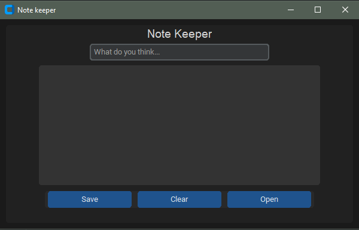

# Python Note Keeper


Python Note Keeper is a simple application that allows users to write and manage their notes. It provides a user-friendly interface for creating, saving, and opening notes.

## Features

- Note Entry: Users can type and edit their notes in the provided text area.
- Save Notes: Users can save their notes to a file, providing a filename for easy retrieval later.
- Open Notes: Users can open previously saved notes from their system and view/edit the content.
- Clear Notes: Users can easily clear the note area to start fresh.

## Getting Started

To run the Python Note Keeper, follow these steps:

1. Ensure you have Python installed on your system.
2. Download the code files from the [GitHub repository]([https://github.com/your-repository-link](https://github.com/Untitled-Master/Note-keepe)).
3. Open the terminal or command prompt and navigate to the directory where you saved the code files.
4. Install the required dependencies by running the following command:
   ```
   pip install customtkinter
   ```
5. Run the application by executing the following command:
   ```
   python main.py
   ```
6. The Note Keeper window will appear, allowing you to start writing and managing your notes.

## Usage

1. Enter the content of your note in the provided text area.
2. To save the note, click the "Save" button. You will be prompted to choose a location and provide a filename for the note file.
3. To open a previously saved note, click the "Open" button. Select the note file from your system, and the content will be loaded into the text area.
4. To clear the note area and start fresh, click the "Clear" button.

## Contributions

Contributions to the Python Note Keeper project are welcome. If you encounter any issues or have suggestions for improvements, please submit them through the GitHub repository.

## License

This project is licensed under the [MIT License](https://opensource.org/licenses/MIT). Feel free to use, modify, and distribute the code for personal or commercial purposes.
